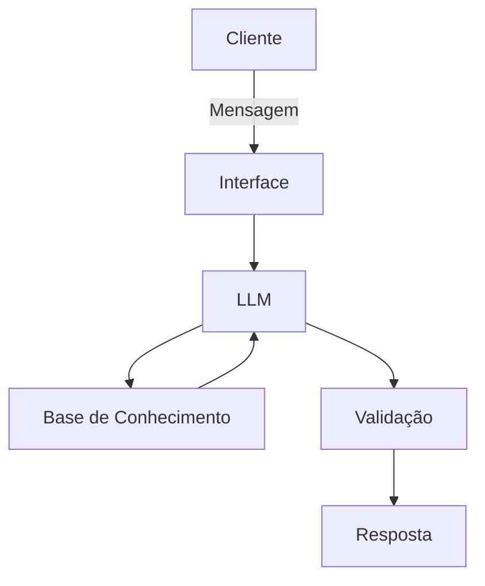

# Documentação do Agente

## Caso de Uso

### Problema
> Qual problema financeiro seu agente resolve?

Pessoas que têm dificuldade em controlar seus gastos mensais e acabam ultrapassando limites sem perceber.

### Solução
> Como o agente resolve esse problema de forma proativa?

O agente monitora transações e emite alertas quando gastos ultrapassam limites pré-definidos. Além disso, sugere metas simples de economia e fornece relatórios básicos por categoria.

### Público-Alvo
> Quem vai usar esse agente?

Qualquer pessoa que queira organizar melhor suas finanças pessoais, sem necessidade de conhecimento técnico em economia.

---

## Persona e Tom de Voz

### Nome do Agente
JULLIUS

### Personalidade
> Como o agente se comporta? (ex: consultivo, direto, educativo)

Direto, preventivo e objetivo.
Focado em alertas curtos e claros, sem rodeios.

### Tom de Comunicação
> Formal, informal, técnico, acessível?

Informal e acessível, usando linguagem simples e próxima do cotidiano.

### Exemplos de Linguagem
- Saudação: "Oi! Vamos dar uma olhada nos seus gastos?"
- Confirmação: "Beleza, entendi. Vou verificar isso pra você."
- Erro/Limitação: "Não tenho essa informação agora, mas posso te ajudar a analisar os gastos registrados."

---

## Arquitetura

### Diagrama

### Componentes

| Componente | Descrição |
|------------|-----------|
| Interface | Chatbot em Streamlit |
| LLM | Modelo de linguagem (GPT-4 via API) |
| Base de Conhecimento | JSON/CSV com transações do cliente |
| Validação | Checagem de consistência e prevenção de alucinações |

---

## Segurança e Anti-Alucinação

### Estratégias Adotadas

- [x] Agente só responde com base nos dados fornecidos pelo usuário ou base mockada.
- [x] Respostas incluem referência à categoria ou transação analisada.
- [x] Quando não sabe, admite e pede mais detalhes ao usuário.
- [x] Não faz recomendações de investimento ou crédito.

### Limitações Declaradas
> O que o agente NÃO faz?

- Não acessa dados bancários reais.
- Não substitui consultoria financeira profissional.
- Não prevê comportamento futuro do usuário.
- Não recomenda produtos financeiros específicos.

